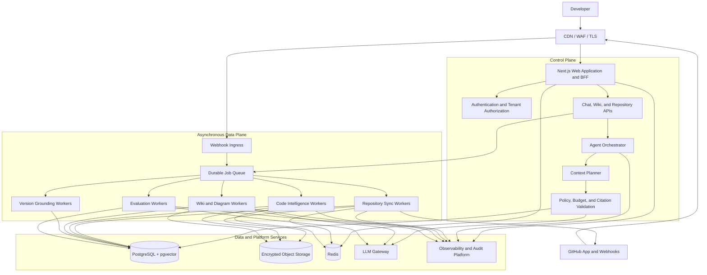
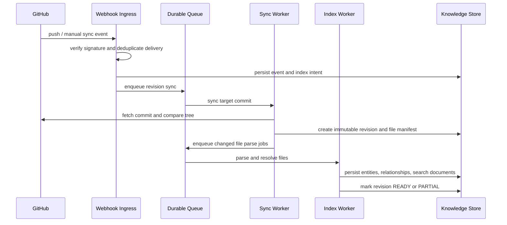
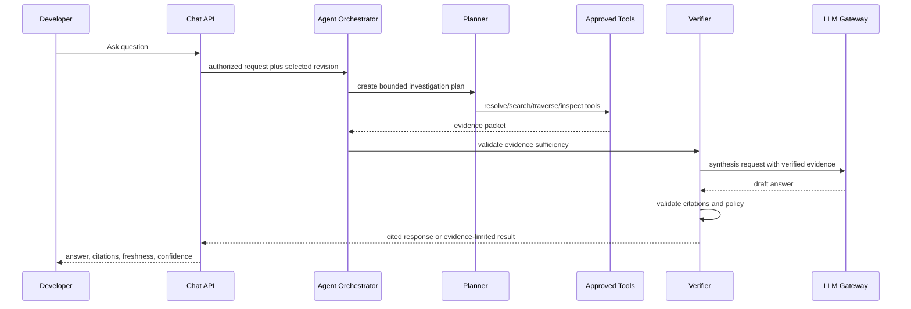

# High-Level Design: CodeSentinel Repository Intelligence Platform

**Status:** Proposed  
**Version:** 1.0  
**Date:** 2026-09-03  
**Next document:** Low-Level Design (LLD)

## 1. Purpose

CodeSentinel is a multi-tenant platform that turns a GitHub repository into a versioned, searchable knowledge system. It helps developers understand an unfamiliar codebase by producing evidence-backed answers, living wiki pages, diagrams, and change-impact analysis.

The platform does not treat an LLM as the source of truth. It builds a deterministic repository index first, then uses bounded agents to investigate the index through approved tools and produce cited explanations.

## 2. Problem Statement

Teams lose time onboarding to large or poorly documented repositories. Existing tools solve only pieces of the problem:

- Code search finds text but does not explain relationships.
- Static analysis finds local problems but does not build a navigable knowledge model.
- Generic repository chat can sound helpful while missing the relevant code or relying on stale context.
- Documentation becomes stale because it is disconnected from commits and source changes.

CodeSentinel addresses this by connecting read-only to GitHub, indexing code per commit, extracting structural relationships, retrieving the relevant architectural slice, and requiring evidence for every repository claim.

## 3. Goals and Non-Goals

### Goals

- Index an authorized GitHub repository incrementally and retain a queryable snapshot for each indexed commit.
- Extract files, symbols, imports/exports, routes, schemas, and selected framework/behavioral relationships.
- Answer repository questions with file/symbol/line citations and visible freshness information.
- Generate reviewable, revision-aware wiki pages and Mermaid diagrams.
- Support bounded multi-step agent workflows for data-flow, change-impact, and onboarding questions.
- Detect framework versions and annotate wiki/chat output with revision-scoped compatibility guidance.
- Index existing repository documentation and ownership signals alongside generated knowledge.
- Maintain tenant isolation, auditability, resilience, and measurable quality.

### Non-goals

- Modifying source code, creating pull requests, or performing GitHub writes.
- Replacing SAST, dependency scanning, or CI systems.
- Guaranteeing a complete call graph for every language and framework.
- Supporting every programming language in the first release.
- Automatically publishing generated documentation without an approval policy.

## 4. Users and Primary Use Cases

| User | Need | Example |
| --- | --- | --- |
| New engineer | Learn a codebase quickly | “How does authentication work?” |
| Maintainer | Locate behavior and ownership | “Where is rate limiting implemented?” |
| Reviewer | Understand impact before a change | “What depends on this service?” |
| Engineering lead | Preserve architecture knowledge | Generate/review module wiki pages |
| Platform operator | Keep indexing reliable and safe | Diagnose a failed repository sync |

### First-release user journeys

1. A user installs the read-only GitHub App and selects a repository.
2. The system indexes a default-branch commit and shows readiness/freshness status.
3. The user browses a repository/module wiki page tied to that commit.
4. The user asks a locational, exploratory, data-flow, schema, or change-impact question.
5. A bounded agent gathers evidence through approved tools and returns a cited answer.
6. The user can open cited source, view the selected revision, and promote a useful result into a wiki draft.
7. The user can navigate existing documentation, generated knowledge, ownership hints, and version warnings in one repository view.

## 5. Architecture Principles

1. **Commit-versioned truth:** every index and generated artifact identifies a Git commit SHA.
2. **Deterministic facts first:** parsers/resolvers establish facts; LLMs explain them.
3. **Evidence before prose:** citations and retrieval provenance are generated before the answer.
4. **Asynchronous heavy work:** sync, parsing, embeddings, generation, and evaluation never block interactive requests.
5. **Bounded agents:** agents can plan and call typed tools but cannot access arbitrary data or modify repositories.
6. **Least privilege:** GitHub integration is read-only, and source sent to models is minimized and policy-controlled.
7. **Observable quality:** system health and answer quality are both production metrics.

## 6. High-Level Component Design



### Component responsibilities

| Component | Responsibility | Synchronous? |
| --- | --- | --- |
| Web/BFF | UI rendering, API validation, session handling, response streaming | Yes |
| Auth and authorization | Tenant membership, repository grants, installation access | Yes |
| Webhook ingress | Verify GitHub delivery, persist event, enqueue work | Yes, lightweight |
| Job queue | Durable dispatch, retries, visibility, backoff, dead-letter handling | No |
| Sync workers | Commit discovery, tree diff, blob retrieval, revision/file manifest | No |
| Index workers | Parse, extract, resolve, build graph/search documents, embed | No |
| Generation workers | Create wiki/diagram drafts from verified evidence | No |
| Version grounding workers | Detect framework versions and API compatibility evidence | No |
| Context planner | Resolve intent, retrieve/rank evidence, enforce context budget | Yes |
| Agent orchestrator | Run bounded investigation workflows with typed tools | Yes, bounded |
| LLM gateway | Provider access, redaction, cost/latency controls, prompt versions | Yes/No |
| Evaluation workers | Regression, quality, safety, and cost evaluations | No |
| PostgreSQL | Authoritative transactional and searchable knowledge state | Yes |
| Object storage | Immutable source snapshots, artifacts, diagnostics | Yes/No |
| Redis | Cache, rate limit, locks, ephemeral coordination | Yes |
| Observability platform | Logs, metrics, traces, audit events, alerting | Yes/No |

## 7. Deployment Model

Use a modular monolith for the control plane and independently scalable worker processes for the data plane.

```text
Internet
  -> CDN/WAF
  -> Web deployment (Next.js)
  -> Webhook ingress deployment
  -> Durable queue
      -> Sync worker pool
      -> Index worker pool
      -> Generation worker pool
      -> Evaluation/maintenance worker pool

Shared managed services
  -> PostgreSQL with pgvector
  -> Object storage
  -> Redis
  -> Secrets manager
  -> LLM provider(s)
  -> Observability platform
```

This deployment model isolates interactive traffic from expensive indexing and model work. It can begin with one worker process and separate into pools by queue type when throughput, memory, or failure isolation demands it.

## 8. Repository Index Lifecycle

### State model

```text
DISCONNECTED -> CONNECTED -> QUEUED -> SYNCING -> EXTRACTING -> READY
                                      |             |
                                      v             v
                                    FAILED <----- PARTIAL

READY -> STALE -> QUEUED
```

### Index flow



### Incremental behavior

- A revision is keyed by repository plus commit SHA plus pipeline version.
- Git tree and blob hashes identify unchanged files and enable reuse.
- Only changed supported files are retrieved, parsed, embedded, and re-summarized.
- Changed exports/imports trigger relationship resolution for affected dependents.
- The previous `READY` revision remains queryable until the target revision reaches `READY`.
- Failed optional enrichments produce `PARTIAL`; required extraction failures do not replace the last known-good revision.

## 9. Knowledge Store

### Logical data model

```text
Tenant
  -> Membership
  -> GitHubInstallation
  -> Repository
  -> RepositoryRevision
  -> RepositoryFile
  -> CodeEntity
  -> CodeRelationship
  -> SearchDocument
  -> FrameworkProfile / CompatibilityAnnotation
  -> WikiPage / Diagram / ChatAnswer

RepositoryRevision
  -> IndexJob
  -> AgentRun
  -> EvaluationRun
  -> AuditEvent
```

### Storage allocation

| Data | Store | Rationale |
| --- | --- | --- |
| Tenants, permissions, jobs, revisions, graph, wiki metadata | PostgreSQL | Transactions, tenant filtering, joins, auditability |
| Lexical search | PostgreSQL `tsvector`/GIN | Strong exact identifier/path search with one source of truth |
| Semantic retrieval | PostgreSQL `pgvector`/HNSW | Initial production scale without a second knowledge store |
| Source snapshots and large artifacts | Object storage | Cheap immutable content and lifecycle policies |
| Rate limits, locks, short-lived cache | Redis | Low-latency ephemeral coordination |
| Logs, metrics, traces | Observability platform | Operational query and alerting workload |

## 10. Code Intelligence Design

### Pipeline

```text
Classify file
  -> Select parser
  -> Build AST
  -> Extract symbols and exports
  -> Collect references
  -> Resolve modules and symbols
  -> Run framework adapters
  -> Persist typed graph relationships
  -> Create search documents and embeddings
```

### Extraction tiers

| Tier | Examples | Reliability expectation |
| --- | --- | --- |
| Structural | files, folders, symbols, imports, exports, containment | Required, deterministic |
| Framework | routes, ORM models, React components, configuration | Required only for supported adapters |
| Version grounding | manifests, lockfiles, framework config, detected API patterns | Revision-scoped evidence; never infer without sources |
| Behavioral | fetch-to-route, store access, model queries, call chains | Best effort; evidence and confidence mandatory |

The first supported languages should be TypeScript and JavaScript. Other languages may be catalogued and lexically searchable, but must not be represented as graph-complete before their parser and resolver quality has been validated.

Every relationship stores its extraction evidence, confidence, resolver status, and extractor version. Unresolved references remain explicit unresolved records; they are not turned into graph facts.

Existing `README` files, `/docs`, architecture decision records, and configured documentation paths are indexed as first-class evidence. Generated content cites source code and repository documentation separately, and never overwrites a human-authored document.

## 11. Agentic Query Architecture

### Why agents are used

Some questions require more than a single search result. The agentic layer coordinates a bounded multi-step investigation: resolve a route, trace relationships, inspect targeted spans, compare evidence, and synthesize a cited answer.

### Agent workflow



### Tool policy

| Tool | Purpose | Limits |
| --- | --- | --- |
| `resolve_entity` | Resolve exact symbol, route, or path | authorized revision only |
| `search_repository` | Lexical and semantic candidate retrieval | result count/bytes capped |
| `traverse_graph` | Follow typed, high-confidence relationships | depth/fan-out/type capped |
| `read_source_span` | Inspect narrow cited source | line/span/policy capped |
| `compare_revisions` | Determine source/graph changes | same repository, two authorized revisions |
| `get_wiki_artifact` | Read current/stale artifact with provenance | tenant scoped |
| `draft_artifact` | Create unpublished wiki/diagram draft | approval required to publish |

Agents cannot issue arbitrary SQL, execute shell commands, access arbitrary URLs, receive raw GitHub tokens, modify GitHub, or publish content automatically.

## 12. Retrieval and Answer Flow

```text
Question
  -> authorize tenant/repository/revision
  -> resolve direct identifiers and paths
  -> lexical retrieval
  -> semantic retrieval
  -> intent-specific graph traversal
  -> rank and diversify evidence
  -> apply content/redaction/token budget
  -> validate evidence packet
  -> synthesize answer
  -> validate citations
  -> stream answer plus provenance
```

### Intent-to-retrieval mapping

| Intent | Retrieval emphasis | Typical output |
| --- | --- | --- |
| Locational | exact paths, symbols, shallow neighbors | source pointers |
| Exploratory | entry points, module summaries, dependency edges | explanation, optional flowchart |
| Data flow | routes, calls, fetches, stores, models | traced explanation, optional sequence diagram |
| Schema | models, migrations, data access relationships | schema explanation, optional ER diagram |
| Change impact | revision diff, dependents, callers, tests | ranked impact report |

The response contract includes selected revision, freshness state, citations with spans, confidence, and explicit limitations. The server validates citations against the evidence packet; the model never invents a source reference.

## 13. Wiki and Diagram Architecture

### Wiki

The wiki is the durable product artifact. Pages are scoped to a repository, revision, and domain/module/folder. Each page stores source citations, artifact generation version, freshness, and review status:

```text
GENERATED -> HUMAN_REVIEWED -> STALE -> ARCHIVED
```

Chat answers can be promoted only into a draft. Human approval is required before publishing or replacing reviewed content.

The wiki UI presents a repository tree, existing/generated-document badges, revision selector, stale indicator, source citations, version warnings, and ownership hints. Page generation is prioritized for the repository overview, top-level folders, route/service/model modules, and user-requested scopes; it does not generate a page for every directory.

### Diagrams

Diagrams are generated from a typed graph slice and verified source evidence, not unrestricted prose. Mermaid is validated before rendering. If a data-flow graph contains low-confidence or unresolved edges, the system either labels uncertainty or declines to draw that flow.

Ownership is initially derived from revision-scoped `CODEOWNERS` rules. It is an onboarding hint, not a security boundary or a guarantee of current maintainership. Contribution- or team-derived ownership is deferred until permissions and privacy policies are approved.

## 14. Security and Tenant Isolation

### GitHub access

- Use a GitHub App limited to `Contents: read` and `Metadata: read`.
- Verify webhook signatures and deduplicate deliveries.
- Obtain installation-scoped tokens only in sync workers.
- Never expose GitHub tokens to browser clients, agents, or LLM providers.

### Application security

- Authenticate users and authorize every repository request by tenant membership and installation grant.
- Add `tenant_id` to every tenant-owned record and require it in database access helpers.
- Use Redis-backed distributed rate limiting for interactive APIs; in-memory counters are prototype-only.
- Use encrypted transport, a secrets manager, key rotation, and least-privileged service credentials.
- Apply source exclusion/redaction policies before storage, embeddings, retrieval, and model calls.
- Treat source content and LLM prompts as sensitive; log metadata/hashes by default rather than raw content.
- Preserve append-only audit events for source access, job actions, agent runs, artifact publication, and policy decisions.

## 15. Reliability and Failure Handling

| Failure | System behavior |
| --- | --- |
| Duplicate webhook | Deduplicate by GitHub delivery ID and idempotency key |
| GitHub API timeout/rate limit | Retry with backoff; enforce per-installation concurrency |
| Parser failure on one file | Capture diagnostic; mark enrichment partial while retaining eligible results |
| Worker crash | Resume/retry durable job from persisted state |
| LLM outage | Preserve retrieval evidence; return delayed/limited result or retry generation |
| New revision fails indexing | Keep prior ready revision queryable |
| Citation validation fails | Reject model draft and return evidence-limited response |
| Redis outage | Degrade cache/locks/rate controls safely; do not lose authoritative state |

The queue uses retry policies, dead-letter handling, visibility timeouts, and idempotency keys. State transitions and job enqueue intents are written through a transactional outbox to avoid lost-work failures.

## 16. Observability

### Trace model

Every request, job, and agent run carries shared identifiers:

```text
trace_id, request_id, tenant_id, repository_id, revision_id,
job_id, agent_run_id, pipeline_version, policy_version
```

### Metrics and events

| Area | Examples |
| --- | --- |
| Availability | request success, API error rate, webhook acceptance |
| Queue health | depth, age, retries, dead-letter count, worker utilization |
| Index quality | files indexed/skipped/failed, parse rate, resolution rate, revision readiness |
| Retrieval | exact-match success, recall evaluation, graph expansion size, latency |
| Agent quality | tool call count, plan changes, verifier rejects, incomplete runs |
| Model operations | provider error rate, first-token latency, tokens, cost, fallback use |
| Grounding | citation coverage, invalid citation rate, abstention rate |
| Version grounding | version-evidence coverage, correct applicability, stale-registry rate |
| Security | denied authorization, policy block, source-redaction event |

Operators need a trace view for every agent answer: revision, tools, evidence packet, model/prompt version, verifier result, latency, and cost. Users receive a simplified provenance view limited to their repository access.

## 17. Evaluation Architecture

### Quality gates

The platform is evaluated at six layers:

| Layer | Measured outcome |
| --- | --- |
| Extraction | symbols, routes, imports, and schemas match known fixtures |
| Version grounding | detected versions/API annotations match fixture manifests and source evidence |
| Resolution | references resolve to correct files/entities |
| Retrieval | required evidence appears in top-k candidates |
| Grounding | answer claims/citations are supported by the evidence packet |
| User task | answer helps complete onboarding/discovery task correctly |
| Operations | workflows meet latency, cost, reliability, and freshness budgets |

### Evaluation loop

```text
Versioned fixtures + expected evidence
  -> CI extraction/retrieval tests
  -> model/agent workflow evaluation
  -> regression gate
  -> shadow production comparison
  -> sampled human review and user feedback
  -> labeled failures added to evaluation corpus
```

Use deterministic checks for source revision, tool-policy compliance, citation validity, and graph evidence. LLM judging may supplement human/rubric review but must not be the only release gate.

## 18. Scalability Plan

| Growth stage | Architecture posture |
| --- | --- |
| Initial production | Single web deployment, queue-backed worker deployment, managed PostgreSQL/pgvector, object storage, Redis |
| Growth | Separate worker pools, PostgreSQL read replicas, tuned vector indexes, quotas, usage metering |
| Enterprise | Regional workers, tenant-aware partitioning, data-residency controls, private provider options, specialized search only if measured |

Avoid adding a graph database, standalone vector database, Kafka, or Kubernetes merely for perceived maturity. Add specialized infrastructure only when measured performance, compliance, or operational data demonstrates a requirement.

## 19. Non-Functional Requirements

| Category | Initial target |
| --- | --- |
| Availability | 99.9% monthly for control-plane APIs |
| Chat responsiveness | p95 first token under 4 seconds for a ready index, provider permitting |
| Indexing | p95 small-repository sync under 5 minutes |
| Data integrity | revision, tenant, and citation ownership enforced for every response |
| Recovery | PostgreSQL point-in-time recovery and tested restore procedure |
| Security | zero GitHub write scopes; secrets never sent to clients/models |
| Quality | 100% non-trivial repository claims include validated evidence citations |

## 20. Delivery Sequence

1. Add tenant-aware repository revisions, index jobs, audit records, and transactional outbox.
2. Move indexing to durable workers; make sync commit-based and incremental.
3. Harden TypeScript/JavaScript structural extraction and module-aware resolution.
4. Build hybrid retrieval, context packing, revision-aware citations, and user provenance UI.
5. Introduce bounded agent workflows for Q&A and change impact with persisted traces and verification.
6. Add wiki/diagram drafts as asynchronous, reviewable artifacts.
7. Add version grounding, existing-document ingestion, ownership hints, and the wiki navigation model.
8. Establish evaluation corpus, CI gates, shadow runs, dashboards, alerts, and runbooks.

## 21. Open Decisions for LLD

- Specific durable queue technology and deployment environment.
- Database schema, migration strategy, retention policy, and row-level-security approach.
- Parser worker runtime and language-plugin packaging.
- Exact graph resolver algorithms and framework adapter contracts.
- API endpoint payloads, streaming transport, pagination, and error codes.
- Agent state-machine implementation and tool schemas.
- Observability vendor/configuration, trace retention, and redaction controls.
- Evaluation fixture format, scoring thresholds, and release-gate ownership.

## 22. HLD Decision

Proceed with a versioned, PostgreSQL-centered repository knowledge store; asynchronous indexing workers; bounded tool-using agents; and built-in observability/evaluation. This provides a production-ready foundation while keeping the first release focused on trustworthy single-repository understanding rather than broad but unreliable automation.
