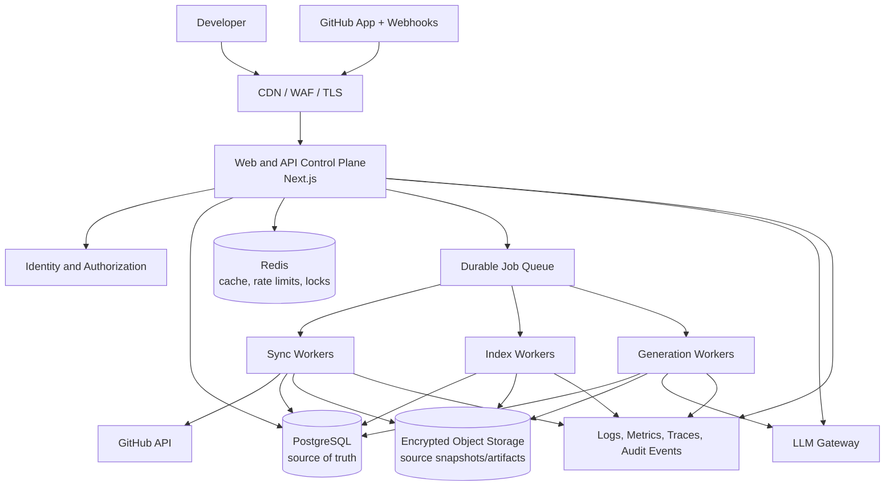
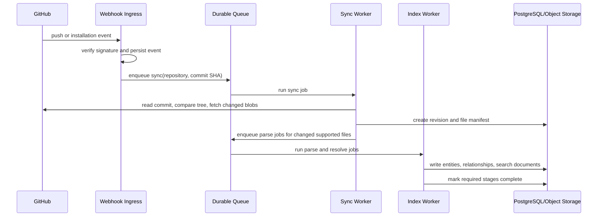
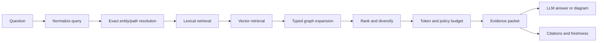
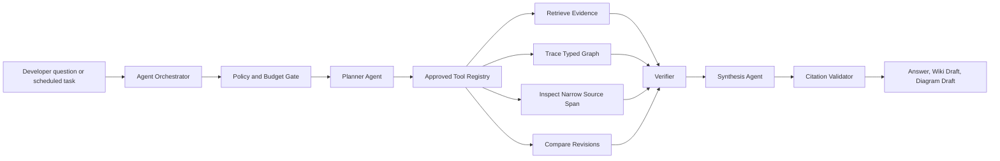

# CodeSentinel Production Architecture

**Status:** Recommended target architecture  
**Date:** 2026-09-03  
**Scope:** Multi-tenant repository-intelligence platform

## Executive Decision

Build CodeSentinel as a **modular application with an asynchronous data plane**, not as a set of microservices from day one.

The user-facing control plane stays in Next.js: authentication, repository connection, status, wiki browsing, chat streaming, and approvals. A durable queue routes synchronization, parsing, graph construction, embeddings, and wiki generation to independently deployable workers. PostgreSQL is the durable system of record, with object storage for source snapshots and generated artifacts, Redis for ephemeral coordination, and an observability stack across all services.

This split protects interactive latency from long-running index work, produces auditable repository revisions, and gives the system a clean path to scale individual workloads when real usage demands it.

## Design Goals

- Answer repository questions with verifiable evidence from a named commit.
- Isolate tenants, repository installations, and source content by default.
- Make indexing resilient to GitHub events, retries, duplicates, and partial failure.
- Keep interactive wiki and chat requests fast even during a large re-index.
- Make generated knowledge stale-aware, reviewable, and reproducible.
- Permit gradual scaling without prematurely operating many independently complex services.

## System Boundaries



### Control plane

The control plane owns user-facing, short-lived work:

- OAuth/session handling and organization membership.
- GitHub App installation connection and repository selection.
- Authorization for every repository, revision, file, wiki, and chat request.
- Webhook verification and lightweight event intake.
- Query planning, retrieval, streamed answer delivery, and citation rendering.
- Index status, failures, freshness, review, and approval interfaces.

It must never parse an entire repository, generate embeddings in a loop, or generate wiki pages synchronously in an HTTP request.

### Data plane

The data plane owns durable, long-running work:

- Commit discovery and incremental GitHub synchronization.
- File classification, content retrieval, source snapshot storage, and hashing.
- AST parsing, symbol extraction, module resolution, and graph construction.
- Search-document creation and embeddings.
- Wiki/diagram generation and regeneration.
- Cleanup, retention enforcement, reindexing, and quality evaluation jobs.

Workers can be deployed and autoscaled separately by queue type and workload profile.

## Recommended Deployment Topology

| Deployment | Scaling trigger | Workload | Failure isolation |
| --- | --- | --- | --- |
| `web` | HTTP concurrency/latency | UI, APIs, streamed chat | User traffic remains available during indexing incidents |
| `webhook-ingress` | event rate | Signature verification, event persistence, enqueue only | GitHub delivery spikes do not consume web capacity |
| `sync-worker` | sync queue depth | GitHub tree/diff/blob retrieval | GitHub rate limits do not block parsing or chat |
| `index-worker` | parse queue depth/CPU | AST extraction, resolution, graph/search writes | CPU-heavy parsing is isolated |
| `generation-worker` | generation queue depth | summaries, diagrams, LLM enrichment | model outages do not block index readiness |
| `maintenance-worker` | scheduled | stale detection, retention, backfills, evaluations | housekeeping remains off request paths |

Begin with `web` and a single `worker` deployment containing named queues. Split those workers into the topology above when queue throughput, memory use, or incident isolation requires it. The application modules and job contracts should be separate from the first deployment so this split is operational rather than a rewrite.

## Core Data Architecture

### PostgreSQL: authoritative metadata and knowledge index

PostgreSQL is the source of truth for all business state. It stores:

- Tenants, users, memberships, GitHub installations, and repository grants.
- Repository identity, branch configuration, revisions, and index lifecycle.
- File manifests, file hashes, and source-object references.
- Code entities, typed relationships, evidence, resolution state, and confidence.
- Search documents, full-text indexes, and vector embeddings.
- Wiki pages, diagrams, reviews, chat citations, audit events, and job records.

Every repository-derived record must include `tenant_id`, `repository_id`, and `revision_id` where applicable. Enforce tenant scoping in database access helpers rather than relying on route-level checks alone.

### Object storage: immutable large content

Use encrypted object storage for:

- Source blobs or normalized source snapshots when retention policy permits.
- Large generated wiki exports and diagram artifacts.
- Parse diagnostics and job attachments.
- Evaluation fixtures that are explicitly approved for storage.

Use content-addressed object keys derived from a source blob SHA. Persist only the key, hash, byte size, MIME type, and retention class in PostgreSQL. Never require all source content to live in the application database.

### Redis: explicitly non-authoritative state

Redis supports:

- Rate limits and abuse controls.
- Short-lived retrieval/result caching.
- Distributed locks for a repository and revision.
- Queue transport if the selected queue uses it.
- Streaming/session coordination where necessary.

Any Redis eviction must be survivable. Index status, source of truth permissions, and completed work must not exist only in Redis.

### Search and graph strategy

Use PostgreSQL first:

- `tsvector` plus GIN indexes for lexical search over path, names, signatures, comments, and curated docs.
- `pgvector` with HNSW indexes for semantic retrieval of files, entities, and summaries.
- Normalized entity and relationship tables for graph traversal.

This is production-capable for the initial product and removes cross-store consistency problems. Add a dedicated search engine only after measured relevance or scale needs cannot be met by PostgreSQL. Add a graph database only if deep traversals become a verified bottleneck; it is not a prerequisite for an accurate repository graph.

## Versioned Repository Model

```text
Tenant
  -> GitHubInstallation
  -> Repository
  -> RepositoryRevision (commit SHA, pipeline version, status)
  -> RepositoryFile (path, blob SHA, source object reference)
  -> CodeEntity (file-scoped symbols, routes, schemas, components)
  -> CodeRelationship (typed edge + evidence + confidence)
  -> SearchDocument (chunk/entity summary + lexical/vector indexes)
  -> WikiPage / Diagram / ChatAnswer (all tied to a revision)
```

`RepositoryRevision` is the non-negotiable boundary. Index a commit, not an abstract repository “current state.” A new default-branch commit creates a new revision and makes older artifacts visibly stale. This provides reproducibility, safe rollback, and honest citations.

## Ingestion and Indexing Pipeline



### Job contract

Every job includes:

- `job_id`, `tenant_id`, `repository_id`, `revision_id`, and `pipeline_version`.
- Idempotency key: `repository_id:commit_sha:pipeline_version:stage`.
- Attempt count, retry policy, deadline, and causal event ID.
- Structured progress metrics and an operator-visible error record.

Use the transactional outbox pattern for state changes that enqueue work: write the database state transition and outbox record in one transaction, then deliver to the queue. This prevents “indexed in the database but no job was ever sent” failures.

### Indexing stages

1. Discover target commit and create revision idempotently.
2. Compare Git trees with the preceding ready revision.
3. Apply path, size, binary, generated-code, and tenant exclusion policies.
4. Retrieve and store only changed eligible source blobs.
5. Parse files and extract structural facts.
6. Resolve imports/exports and framework-specific entities against the revision.
7. Persist typed relationships with evidence and confidence.
8. Generate or reuse search documents and embeddings by content hash.
9. Mark the revision `READY` after required stages succeed.
10. Run optional summaries and diagrams afterward; they can fail independently.

Never delete the prior ready revision before the target revision is ready. A failed reindex must leave a known-good index available for queries.

## Code Intelligence Architecture

### Extraction layers

| Layer | Output | Production rule |
| --- | --- | --- |
| File intelligence | language, generated/binary status, config role, hashes | Deterministic and complete for indexed files |
| Syntax intelligence | AST, symbols, declarations, imports, exports | Language-specific parser with parse diagnostics |
| Resolution intelligence | import targets, exported symbols, aliases, inheritance | Resolve against repository and package configuration |
| Framework intelligence | routes, ORM models, components, stores, service conventions | Plugin/adapter per supported framework |
| Behavioral intelligence | fetch-to-route, model access, store reads/writes, calls | Best-effort only; retain evidence and confidence |

Define an extractor interface with a stable contract:

```ts
interface RevisionExtractor {
  supports(file: IndexableFile): boolean;
  extract(input: ExtractorInput): Promise<ExtractionResult>;
}
```

`ExtractionResult` must contain facts, unresolved references, diagnostics, evidence spans, extractor version, and confidence. Keep raw references unresolved until a dedicated resolver confirms their target. A globally shared symbol name is not a production-safe resolver.

### Pipeline versioning

Store the parser, extractor, resolver, embedding, and prompt versions used for each revision. Re-run selected enrichment stages when a pipeline version changes, without confusing that work with a Git source change.

## Query and Context Architecture



### Context planner requirements

- Scope every query to an authorized repository revision. Default to the latest `READY` revision and disclose it.
- Resolve exact paths, symbols, routes, and identifiers before broad similarity search.
- Retrieve lexical, semantic, and graph candidates independently, then fuse rankings rather than appending results in arbitrary order.
- Use typed, depth-limited graph traversals that differ by intent.
- Prefer high-confidence relationships and direct source spans.
- Diversify by module/file to avoid filling the context window with one large component.
- Enforce an explicit byte/token budget and redact content by policy before the LLM boundary.
- Return the evidence packet and citation IDs independent of model output.

### Answer contract

An answer response should include:

```json
{
  "revision": { "commitSha": "...", "status": "READY", "isStale": false },
  "answer": "...",
  "citations": [
    { "filePath": "src/auth/session.ts", "startLine": 12, "endLine": 46, "entityId": "..." }
  ],
  "confidence": "supported | partial | insufficient_evidence",
  "diagram": null
}
```

The model may not invent citations. The server validates each citation against the evidence packet before sending the response. If evidence is insufficient, answer with a scoped limitation and retrieval suggestions rather than speculative architecture.

## LLM Gateway

Put all model access behind a provider-neutral internal gateway. Its responsibilities are:

- Model/provider selection per tenant and capability.
- Request validation, prompt templates, context-size controls, and source redaction.
- Retry/circuit-breaker behavior and fallbacks for transient provider failures.
- Usage, latency, error, and cost telemetry.
- Prompt/model version recording for generated artifacts.
- Optional tenant controls for zero-retention or self-hosted/approved providers.

The gateway accepts an evidence packet, not arbitrary repository access. Workers and routes must not hand a model database credentials or a repository token.

## Agentic Intelligence Layer

### Decision

Use agents as **bounded investigators and artifact planners**, not autonomous repository operators. The agent decides which approved retrieval and analysis tools to call, in what order, and when the available evidence is insufficient. Deterministic services still own indexing, parsing, authorization, persistence, and publication.

This preserves the value of an agentic workflow - multi-step investigation, adaptive retrieval, and structured synthesis - without making production correctness depend on unbounded model behavior.



### Agent roles

| Role | Responsibility | May do | Must not do |
| --- | --- | --- | --- |
| Orchestrator | Owns request lifecycle, budgets, and state transitions | Start/resume runs, route to a workflow, record trace | Access source or model providers directly |
| Planner | Turns a goal into a bounded investigation plan | Select approved tools and stop when evidence is adequate | Call tools outside policy or bypass budgets |
| Retrieval agent | Finds candidate repository evidence | Resolve symbols, search, traverse typed graph | Claim a conclusion without returned evidence |
| Analysis agent | Interprets evidence for a specific task | Compare revisions, trace a flow, identify uncertainty | Modify source, database state, or GitHub |
| Synthesis agent | Writes a cited answer, wiki draft, or Mermaid draft | Transform verified evidence into a user artifact | Create citations or facts not in its packet |
| Verifier | Checks grounding and output constraints | Request more evidence, downgrade confidence, reject output | Replace source-of-truth extractors |

Start with one orchestrator workflow and role-specific prompts/models, not separately deployed “agents.” The roles are logical boundaries that make traces, evaluations, and permissions understandable. Split execution only when workload isolation requires it.

### Approved tool registry

Agents interact only through typed tools. Each tool receives the caller's tenant, repository, revision, policy, token budget, and trace context from the server; agents never supply those values themselves.

| Tool | Input | Output | Guardrail |
| --- | --- | --- | --- |
| `resolve_entity` | identifier/path plus revision | exact entities and ambiguity | tenant/revision constrained |
| `search_repository` | query and retrieval mode | scored search documents | result count and byte capped |
| `traverse_graph` | seed entities, typed edges, max depth | nodes/edges with evidence | depth, fan-out, and confidence capped |
| `read_source_span` | file entity and line span | redacted source span | maximum span and path policy enforced |
| `compare_revisions` | two authorized revisions and scope | changed files/entities/edges | same repository only initially |
| `get_wiki_artifact` | page/diagram ID | versioned artifact and citations | stale status returned |
| `draft_artifact` | verified evidence packet | unpublished wiki/diagram draft | no automatic publication |

No tool may execute shell commands, fetch arbitrary URLs, call GitHub write APIs, use unscoped SQL, or return unrestricted repository content. A read-only GitHub App token stays in the sync worker and is never exposed as an agent tool.

### Workflow types

| Workflow | Agent behavior | Terminal outcome |
| --- | --- | --- |
| Repository Q&A | retrieve, inspect, verify, synthesize | cited answer or insufficient-evidence response |
| Data-flow investigation | identify entry point, traverse verified relationships, inspect critical spans | cited explanation and optional diagram draft |
| Change-impact analysis | compare revisions, expand dependents, verify high-impact edges | impacted entities with confidence |
| Wiki generation | collect module evidence, draft, verify citations | reviewable wiki draft |
| Index remediation | inspect job diagnostics and retryable states | operator-visible recommendation; no silent repair |

### Run state and safety limits

Persist every agent run in an `AgentRun` record with the goal, workflow type, selected revision, policy version, tool calls, model/prompt versions, budgets, outputs, and terminal state.

```text
CREATED -> PLANNING -> EXECUTING -> VERIFYING -> COMPLETED
                          |             |
                          v             v
                     NEEDS_INPUT      REJECTED
                          |
                          v
                        FAILED
```

Set hard limits per run: maximum tool calls, graph depth, source bytes, wall-clock time, model tokens, model cost, retries, and number of generated artifacts. A run that reaches a limit returns a partial result with its evidence and a clear reason; it does not silently keep exploring.

### Human approval policy

- Chat answers may be streamed after citation validation.
- Wiki pages and diagrams are created as drafts by default.
- Publishing, replacing human-reviewed content, changing repository configuration, or triggering a broad reindex requires an authorized user action.
- Agents cannot merge code, open pull requests, modify GitHub settings, or write back to a repository in this product scope.

## Security Architecture

### Trust boundaries

| Boundary | Required controls |
| --- | --- |
| Browser to API | TLS, session auth, CSRF protection where applicable, schema validation, rate limits |
| GitHub to webhook ingress | Signature validation, event ID deduplication, narrow payload logging |
| API to data store | Tenant-scoped queries, least-privileged credentials, encrypted transport |
| Workers to GitHub | Installation-scoped tokens only, concurrency/rate-limit controls, no write scopes |
| Application to LLM | Redaction policy, minimal context packet, usage audit, provider isolation |
| Operator access | SSO/MFA, audited production access, secret rotation, no direct customer-source browsing by default |

### Multi-tenancy

- Model organizations/tenants explicitly, not merely as a `user_id` column.
- Require membership and repository grant checks for every request.
- Include `tenant_id` in composite indexes and access-layer filters.
- Consider PostgreSQL row-level security as a defense-in-depth layer after query patterns are stable.
- Use separate encryption keys or key-encryption contexts per tenant for high-sensitivity source storage.

### Source-code policy

- Default-deny binary, build output, dependencies, secrets, lockfiles, generated files, and configured sensitive paths.
- Detect common secret patterns before persistence and model submission; block or redact according to tenant policy.
- Support configurable retention windows and repository deletion workflows.
- Record artifact provenance without retaining full prompts or source in application logs.

## Reliability, Observability, and Operations

### Service level objectives

Set initial targets, then tune against observed workloads:

| Signal | Initial target |
| --- | --- |
| API availability | 99.9% monthly |
| Chat first-token latency on ready index | p95 under 4 seconds, provider permitting |
| Manual sync time for a small repository | p95 under 5 minutes |
| Webhook enqueue success | 99.99% |
| Ready-index integrity | 100% revision and tenant ownership validation |
| Citation coverage | 100% of non-trivial repository claims cite retrieved evidence |

### Required telemetry

- Emit OpenTelemetry-compatible traces across the browser request, API, agent run, individual model call, tool call, queue transition, and worker stage.
- Attach `trace_id`, `request_id`, `tenant_id`, `repository_id`, `revision_id`, `agent_run_id`, `job_id`, and `pipeline_version` to every structured event where applicable.
- Record agent plans, tool inputs/outputs as safe references and hashes, tool latency, retries, budget consumption, verifier decisions, terminal state, and user-visible confidence. Do not log raw source or unredacted prompts by default.
- Record model/provider, model and prompt version, input/output token counts, latency, error class, cache status, and estimated cost for every generation.
- Measure queue depth, queue age, retries, stage duration, parse errors, graph-resolution rates, embedding failures, retrieval latency, citation-validation failures, stale revisions, and tenant quota usage.
- Alert for failed jobs, queue age, GitHub rate-limit pressure, missing webhook deliveries, high model error rates, citation-validation rejection spikes, authorization violations, and budget-limit exhaustion.
- Retain immutable audit events for source access, syncs, agent runs, generated/published documentation, policy decisions, and approval actions.

### Agent observability contract

An operator and an authorized repository administrator must be able to answer these questions for any response:

1. Which repository revision did this run use?
2. Which workflow and policy version controlled it?
3. Which tools were invoked, in what order, and why did the planner choose them?
4. Which files, entities, and relationships entered the evidence packet?
5. Which model/prompt version synthesized the result, at what cost and latency?
6. Did the verifier accept, downgrade, or reject the output?

Expose this through a trace view for operators and a simplified provenance view for end users. Tenant administrators see only their own traces and source references.

## Evaluation and Quality System

Evaluation is a production subsystem, not a one-time pre-launch exercise. The system must continuously measure whether it retrieves the right evidence, makes grounded claims, remains fresh, and creates useful artifacts.

### Evaluation layers

| Layer | Question measured | Example metric |
| --- | --- | --- |
| Extraction | Did deterministic intelligence reflect source correctly? | symbol/route/import precision and recall against fixtures |
| Resolution | Did references map to the correct target? | exact module and symbol resolution rate |
| Retrieval | Did the context planner find the evidence needed? | recall@k, MRR, evidence coverage, latency |
| Grounding | Is each answer claim supported by returned evidence? | citation precision, citation completeness, unsupported-claim rate |
| Task success | Did the user receive a correct, useful result? | expert rubric score, task completion, abstention appropriateness |
| Operational quality | Does the workflow meet production budgets? | p95 latency, cost/run, failure and retry rates |
| Freshness | Does an artifact represent the selected source revision? | stale-artifact rate and time-to-reindex |

### Golden evaluation corpus

Create a versioned, access-controlled corpus of small representative repositories and approved fixtures. For each test case, store:

- Repository revision and source fixture.
- Question or task prompt.
- Expected files, entities, relationships, and minimum evidence spans.
- Expected answer properties, not only a single exact prose answer.
- Expected confidence/abstention behavior where evidence is intentionally incomplete.
- Expected diagram properties for supported diagram workflows.

Seed the corpus with the highest-value onboarding tasks:

- Locate an authentication entry point.
- Trace a request from route to persistence.
- Identify ownership of a module or feature.
- Explain a schema/model relationship.
- Identify impact of changing an exported function.
- Confirm that a missing concept produces an evidence-limited answer rather than a hallucination.

Keep customer source out of shared evaluation fixtures unless the customer has explicitly approved it. Use synthetic or open-source fixtures for baseline regression tests.

### Offline evaluation gates

Run deterministic extraction and retrieval evaluations in CI for relevant changes. Run model-dependent workflow evaluations before changing prompts, models, tool contracts, ranking logic, extractors, or agent policies.

Promotion criteria should include:

- No regression in extraction or resolution correctness beyond an agreed tolerance.
- No regression in retrieval evidence coverage for critical questions.
- Zero unsupported citations in the protected evaluation suite.
- No increase in high-severity safety/policy violations.
- Latency and cost remain within workflow budgets.

Use rubric-based LLM judging only as a secondary signal. Grounding, citation validity, revision matching, and tool-policy compliance must be checked deterministically.

### Online evaluation and feedback

- Capture explicit user feedback separately for answer usefulness, accuracy, citation usefulness, and freshness.
- Allow users to flag a citation as irrelevant or an answer as outdated; route flags to a review queue with the full trace.
- Sample completed runs for human review, stratified by workflow, confidence, tenant, and failure mode.
- Compare production metrics by model, prompt, extractor, ranking, and policy version to detect regressions.
- Use shadow runs for new agents/models on opted-in traffic; compare outputs before exposing them to users.
- Treat overrides, corrections, and accepted wiki drafts as high-value evaluation labels after review.

### Evaluation data model

Persist evaluation artifacts separately from customer runtime data:

```text
EvaluationSuite
  -> EvaluationCase (fixture revision, task, expected evidence/properties)
  -> EvaluationRun (system versions, metrics, verdict)
  -> EvaluationFinding (failure mode, trace reference, owner, resolution)
```

The CI gate reports aggregate scores and links each regression to a traceable evaluation case. Production quality dashboards track both system health and answer quality; an available API is not sufficient evidence that the product is working.

### Backup and recovery

- Point-in-time recovery for PostgreSQL and regularly tested restore procedures.
- Object-storage versioning and lifecycle policies.
- Queue replay from persisted job/outbox records.
- Documented runbooks for GitHub webhook failures, provider outages, indexing failures, accidental deletion, and tenant data deletion requests.

## Scale Evolution

| Stage | Recommended architecture |
| --- | --- |
| Early production | Next.js control plane, PostgreSQL/pgvector, Redis, durable queue, one worker deployment, object storage |
| Growing adoption | Separate sync/index/generation worker pools; read replicas; HNSW tuning; per-tenant quotas and usage metering |
| Enterprise scale | Regional worker pools, tenant-aware sharding strategy, dedicated search only if measured, private-network/provider options, stronger data residency controls |

Do not introduce Kafka, a graph database, a standalone vector database, or Kubernetes merely as a badge of production maturity. Each becomes justified only by measured throughput, query, compliance, or operational needs.

## Implementation Priorities

1. Create `RepositoryRevision`, `IndexJob`, and audit/outbox records; make the current index revision-aware.
2. Move current full indexing out of request handlers into durable jobs with idempotency and retries.
3. Implement incremental sync by commit/tree/blob hash and keep the prior ready revision available.
4. Replace naive name-based edge linking with module-aware resolution, evidence, and confidence.
5. Build a single context-planner service with revision filters, ranking, token packing, and validated citations.
6. Add wiki/diagram generation as optional background work after a revision is ready.
7. Add operational controls, evaluation datasets, and documented recovery before onboarding external repositories at scale.
8. Introduce bounded agent workflows for repository Q&A and change-impact analysis, with typed tools and persisted traces.
9. Gate agent/model/prompt changes on extraction, retrieval, grounding, safety, latency, and cost evaluations.

## Architecture Decision Record

**Decision:** Use a versioned PostgreSQL-centered repository index, a durable asynchronous worker pipeline, and a Next.js control plane.

**Why:** It provides strong correctness, auditability, data isolation, and operational simplicity while the product learns which graph and retrieval workloads truly need specialized infrastructure.

**Consequence:** The first implementation invests in jobs, revisions, evidence, and observability before visual polish or broad language support. That order is intentional: production trust depends on knowing precisely which source revision supports each answer.
