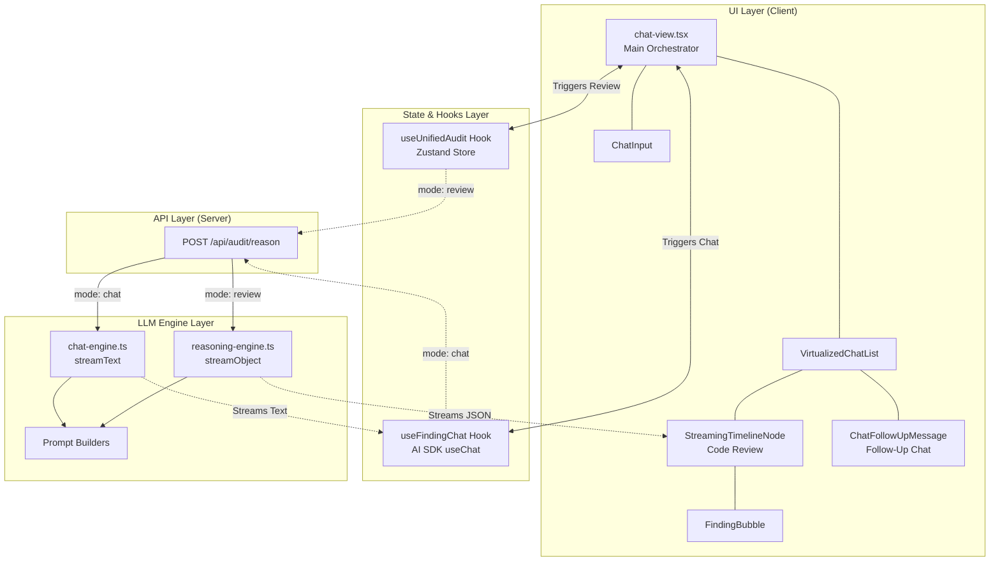
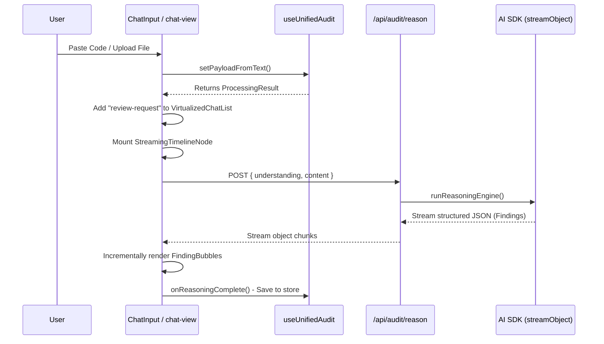
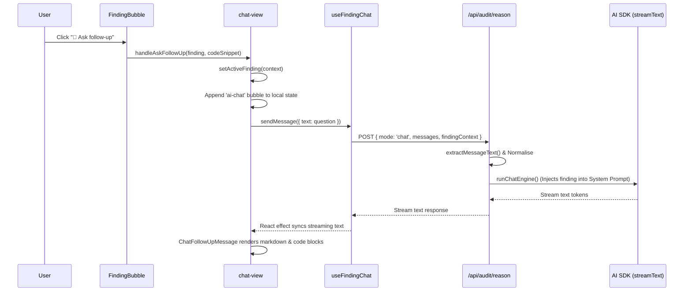

# 🛡️ CodeSentinel

**CodeSentinel** is an AI-powered, real-time code auditing platform built with **Next.js 16**, **React 19**, and the **Vercel AI SDK**. It lets developers paste or upload code snippets and instantly receive a structured, streamed code review — covering security vulnerabilities, performance issues, and architectural patterns — powered by large language models. After a review, developers can open a context-aware follow-up chat scoped to any individual finding.

---

## ✨ Features at a Glance

| Feature | Description |
|---|---|
| 🔍 **Streaming Code Review** | Paste or upload code and get a structured JSON review streamed live from an LLM |
| 💬 **Contextual Follow-Up Chat** | Click any finding and ask follow-up questions; the LLM is automatically injected with the specific code snippet |
| 🧠 **Code Understanding Pipeline** | Deterministic pre-analysis stage that detects language, framework, runtime, artifact type, and architectural signals |
| 📌 **Version Grounding** | Matches detected frameworks against a curated registry (React, Next.js, Prisma, Vue, NestJS, FastAPI, Express) to surface version-specific API risks |
| 🔒 **Auth + Rate Limiting** | Google OAuth via NextAuth, per-user rate limiting on all LLM endpoints, and content-length enforcement |
| ⚡ **Virtualized Chat List** | Large review histories are rendered with `@tanstack/react-virtual` to prevent memory bloat |
| 🎨 **Pattern Confirmation** | Users can correct an auto-detected context (wrong language, wrong framework) before the LLM review fires |

---

## 🏗️ Architecture Overview

The system is built on a modern React (Next.js) stack, heavily utilising the **Vercel AI SDK** to stream both structured JSON (for code findings) and unstructured text (for conversational chat) directly to the UI. Both pipelines share a single API endpoint (`POST /api/audit/reason`), branched by a `mode` flag.

### Component Graph



---

### Data Flow 1: Submitting Code for Review

When a user pastes code or uploads a file, the system runs a structured LLM review.



---

### Data Flow 2: Asking a Follow-Up Question

When a user clicks **💬 Ask follow-up** on a specific finding or types a general question.



---

### Two Streaming Strategies

| Mode | SDK Call | Output Format | UI Renderer |
|------|----------|--------------|-------------|
| `review` | `streamObject` | Strict JSON (Zod schema) | `StreamingTimelineNode` + `FindingBubble` |
| `chat` | `streamText` | Free-form text / Markdown | `ChatFollowUpMessage` |

---

## 📐 Core Modules

### 1. `src/features/code-understanding` — Pre-Analysis Pipeline

Before the LLM ever sees the code, a fully deterministic pipeline runs to build a rich understanding context:

| Stage | File | What it does |
|-------|------|-------------|
| Language Detection | `language-detector.ts` | Regex + heuristic scoring to identify the programming language |
| Framework Detection | `framework-detector.ts` | Identifies React, Next.js, Vue, NestJS, Express, FastAPI, etc. |
| Runtime Detection | `runtime-detector.ts` | Classifies execution environment: browser, Node.js, edge, serverless, CLI |
| Artifact Classification | `artifact-classifier.ts` | Labels the file type: React component, API route, middleware, hook, schema, service, etc. |
| Signal Extraction | `signal-extractor.ts` | Detects architectural patterns (e.g. singleton, pub/sub, factory) |
| Dependency Extraction | `dependency-extractor.ts` | Parses import statements to enumerate third-party libraries |
| Confidence Evaluation | `confidence-evaluator.ts` | Produces an `overallConfidence` score; flags `requiresClarification` when low |
| Clarification Generation | `clarification-generator.ts` | Generates targeted questions for the user when context is ambiguous |

The output of this pipeline (`CodeUnderstandingOutput`) feeds directly into both the LLM prompt and the `PatternConfirmationBubble` UI.

### 2. `src/features/version-grounding` — Framework Version Registry

After dependency extraction, detected frameworks are cross-referenced against a static **Framework Registry** (`framework-registry.ts`). For each framework, the registry tracks:

- **Version brackets** with `minVersion`, `maxVersion`, regex `indicators`, and `confidenceBoost`
- **API patterns** (when each API was introduced or deprecated)
- **Grounding sources** (official documentation URLs, prioritised as primary / secondary / supplementary)

**Supported frameworks:** React (16–19), Next.js (12–15), Express (4–5), Prisma (4–5), Vue (2–3), NestJS (10), FastAPI (0.100+)

The orchestrator (`version-grounding-orchestrator.ts`) uses the registry to:
1. Score which version bracket the code belongs to
2. Detect deprecated or version-mismatched API usage
3. Emit documentation links as `GroundingSource[]` for the LLM prompt

### 3. `src/features/llm-reasoning` — Dual LLM Engines

**`reasoning-engine.ts`** — Code Review  
Calls `streamObject` from the Vercel AI SDK with `temperature: 0.1`. The response is constrained to a strict Zod schema (`ReasoningOutputSchema`), which ensures every finding has:
- `category`, `severity`, `title`, `explanation`, `recommendation`, `evidence[]`

**`chat-engine.ts`** — Follow-Up Chat  
Calls `streamText` with `temperature: 0.3` and `maxOutputTokens: 1024`. When a user clicks a specific `FindingBubble`, the finding's code snippet and metadata are injected as a context prefix into the first user message — minimising token cost while keeping the LLM precisely focused.

### 4. `src/features/audit-dashboard` — UI Layer

**Hooks:**
- `useUnifiedAudit` — Orchestrates the full input → processing → reasoning state machine using a Zustand store. Processing stages: `idle → reading → normalizing → understanding → grounding → reasoning → error`
- `useFindingChat` — Wraps the AI SDK `useChat` hook, pre-configured for the `chat` mode endpoint

**Components:**
- `chat-input.tsx` — Accepts pasted text or uploaded files; validates size, type, and content before staging
- `virtualized-chat-list.tsx` — Windowed list using `@tanstack/react-virtual`; guards against remounting completed reviews
- `timeline-node.tsx` — Renders a single code review card with streaming finding bubbles
- `pattern-confirmation-bubble.tsx` — Lets users correct auto-detected context before submitting to the LLM
- `metrics-card.tsx` — Displays aggregated review metrics (counts by severity/category)
- `health-meter.tsx` — Visual health score indicator
- `skeleton-app-shell.tsx` — Full-page loading skeleton

---

## 🔐 Security & Infrastructure

### Authentication
Google OAuth 2.0 via `next-auth`. All routes are protected by a `withAuth` middleware wrapper (`src/middleware.ts`). Session tokens are checked on every API call via `getServerSession`.

### Rate Limiting
In-memory sliding window rate limiter (`src/lib/rate-limit.ts`). Two rate limit buckets:
- `auth:<ip>` — protects the `/api/auth` endpoint against brute-force
- `reason:<userId>` — limits LLM requests per authenticated user

### Content Safety
`enforceContentLength` + Zod schema validation on every API route input. File uploads are validated for size (configurable via `MAX_UPLOAD_BYTES`) and MIME type before processing.

---

## 📂 Project Structure

```
codeSintler/
├── src/
│   ├── app/
│   │   ├── api/
│   │   │   └── audit/reason/route.ts   # Unified LLM API endpoint (review + chat)
│   │   ├── auth/                       # NextAuth pages
│   │   ├── (private)/                  # Authenticated app routes
│   │   ├── (public)/                   # Public-facing routes
│   │   └── chat-view.tsx               # Main app orchestrator component
│   ├── features/
│   │   ├── audit-dashboard/            # UI components + hooks for the review UI
│   │   │   ├── components/             # chat-input, timeline-node, metrics-card, etc.
│   │   │   ├── hooks/                  # useUnifiedAudit, useFindingChat
│   │   │   └── services/              # audit-engine (processPayload)
│   │   ├── code-understanding/         # Deterministic pre-analysis pipeline
│   │   │   ├── agent.ts               # runCodeUnderstandingAgent()
│   │   │   └── pipeline/              # 8 specialist detector / extractor modules
│   │   ├── llm-reasoning/             # Streaming LLM engines
│   │   │   ├── reasoning-engine.ts    # streamObject → structured findings
│   │   │   ├── chat-engine.ts         # streamText → conversational follow-up
│   │   │   ├── prompt-builder.ts      # System + user prompt for review mode
│   │   │   ├── chat-prompt-builder.ts # System prompt + finding context for chat mode
│   │   │   └── context-builder.ts     # Converts CodeUnderstandingOutput → LLM context
│   │   ├── version-grounding/         # Framework version registry + orchestrator
│   │   │   ├── framework-registry.ts  # Static registry for 7 frameworks
│   │   │   └── version-grounding-orchestrator.ts
│   │   ├── contextual-explainer/      # Inline explanation UI components
│   │   └── auth/                      # Auth-related UI components and hooks
│   ├── lib/
│   │   ├── auth.ts                    # NextAuth config (Google provider)
│   │   ├── rate-limit.ts             # Sliding window rate limiter
│   │   ├── security.ts               # Content-length enforcement, response helpers
│   │   ├── validation.ts             # File size, type, and paste content validators
│   │   ├── logger.ts                 # Structured logger
│   │   └── llm/                      # LLM provider initialisation (NVIDIA API)
│   ├── stores/
│   │   ├── app.store.ts              # Zustand store for global processing state
│   │   ├── session.store.ts          # Auth session state
│   │   ├── theme.store.ts            # Theme preference state
│   │   └── ui.store.ts               # UI interaction state
│   ├── types/                        # Shared TypeScript types
│   ├── middleware.ts                 # Auth + rate-limit middleware (edge)
│   └── workflows/                   # Multi-step workflow flows (onboarding, reporting, etc.)
├── features/                        # Feature design docs and bug reports
├── .env.example                     # Required environment variables template
├── architecture_flow.md             # Mermaid architecture + sequence diagrams
├── next.config.ts
├── tailwind.config.ts
├── vitest.config.ts
└── playwright.config.ts
```

---

## 🚀 Getting Started

### Prerequisites

- **Node.js** ≥ 20
- **npm** ≥ 10
- A **Google Cloud** project with OAuth 2.0 credentials
- An **NVIDIA API** key (for the LLM backend via `https://integrate.api.nvidia.com`)

### 1. Clone & Install

```bash
git clone https://github.com/your-username/codesentinel.git
cd codesentinel
npm install
```

### 2. Configure Environment Variables

Copy the example file and fill in your credentials:

```bash
cp .env.example .env.local
```

| Variable | Description |
|---|---|
| `GOOGLE_CLIENT_ID` | Google OAuth client ID |
| `GOOGLE_CLIENT_SECRET` | Google OAuth client secret |
| `NEXTAUTH_SECRET` | Random secret for NextAuth (`openssl rand -base64 32`) |
| `NEXTAUTH_URL` | Public base URL (e.g. `http://localhost:3000`) |
| `NVIDIA_API_KEY` | NVIDIA NIM API key for LLM access |

> **Google OAuth redirect URI:** `http://localhost:3000/api/auth/callback/google`

### 3. Run the Development Server

```bash
npm run dev
```

Open [http://localhost:3000](http://localhost:3000). You will be redirected to Google sign-in on first load.

---

## 🛠️ Scripts

| Script | Description |
|---|---|
| `npm run dev` | Start Next.js development server with hot reload |
| `npm run build` | Build the production bundle |
| `npm run start` | Start the production server |
| `npm run lint` | Run ESLint across the codebase |
| `npm run test` | Run all unit tests with Vitest (single pass) |
| `npm run test:watch` | Run Vitest in watch mode |

---

## 🧪 Testing

- **Unit Tests** — [Vitest](https://vitest.dev/). Test files live alongside their modules in `__tests__/` subdirectories.
- **End-to-End Tests** — [Playwright](https://playwright.dev/). Config in `playwright.config.ts`.
- **Key test suites:** `code-understanding/`, `llm-reasoning/`, `version-grounding/`, `stores/`

---

## 🧰 Tech Stack

| Layer | Technology |
|---|---|
| Framework | [Next.js 16](https://nextjs.org/) (App Router) |
| Language | [TypeScript 5](https://www.typescriptlang.org/) |
| UI | [React 19](https://react.dev/) |
| Styling | [Tailwind CSS 4](https://tailwindcss.com/) |
| AI / LLM | [Vercel AI SDK 6](https://sdk.vercel.ai/) + NVIDIA NIM |
| Auth | [NextAuth 4](https://next-auth.js.org/) (Google OAuth) |
| State | [Zustand](https://zustand-demo.pmnd.rs/) |
| Validation | [Zod 4](https://zod.dev/) |
| Virtualisation | [@tanstack/react-virtual](https://tanstack.com/virtual/latest) |
| Syntax Highlighting | [highlight.js](https://highlightjs.org/) |
| Unit Testing | [Vitest](https://vitest.dev/) |
| E2E Testing | [Playwright](https://playwright.dev/) |
| Linting | [ESLint 9](https://eslint.org/) |

---

## ⚙️ Key Design Decisions

1. **Single API Endpoint, Dual Modes** — Both the code review and follow-up chat hit `POST /api/audit/reason`, branching on a `mode` field. This lets auth, rate limiting, and model provider initialisation be shared without duplication.

2. **Deterministic Pre-Analysis** — The code understanding pipeline runs entirely on the server without an LLM call. This produces a structured `CodeUnderstandingOutput` that: (a) renders immediately in the UI for user verification, (b) enriches the LLM system prompt with precise context.

3. **Strict Output Schema for Reviews** — `streamObject` + Zod schema guarantees every finding arrives in a predictable shape, allowing the UI to render `FindingBubble` components incrementally as each finding streams in.

4. **Token-Efficient Context Injection** — Follow-up chat does not re-send the entire codebase. Instead, clicking a `FindingBubble` extracts only the relevant code snippet and prepends it to the first user message, drastically reducing token cost.

5. **Virtualization Safety Guard** — `VirtualizedChatList` can unmount and remount components when scrolling. A guard (`if (initialResult.reasoning) return;`) prevents completed `StreamingTimelineNode` components from re-firing the API when scrolled back into view.

6. **Version-Aware Reviews** — The version grounding registry annotates the LLM prompt with which version of a framework the code targets, enabling the model to flag deprecated APIs or recommend version-specific best practices.

---


