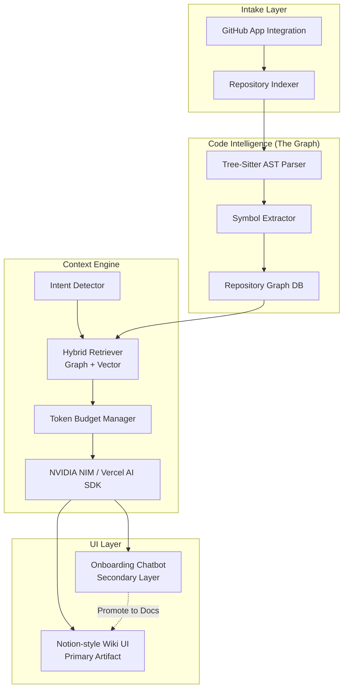

# 🛡️ CodeSentinel (v2)

**CodeSentinel** is an AI-powered **Automated Codebase Wikipedia and Onboarding Agent** built with **Next.js 16**, **React 19**, and the **Vercel AI SDK**. 

It solves the hardest problem in software engineering: onboarding to a massive, undocumented, spaghetti codebase. Instead of relying on stale Notion docs, CodeSentinel securely connects to your GitHub repository, parses the entire dependency graph into an AST, and uses Large Language Models to automatically generate living, breathing documentation and architectural Mermaid diagrams. 

When you have a question ("Where is the rate-limiting logic?"), you don't just search code—you ask the CodeSentinel Chatbot, which leverages a Graph-and-Vector-powered Context Engine to give you a precise, cited answer.

---

## ✨ Features at a Glance

| Feature | Description |
|---|---|
| 📚 **Living Wiki Generation** | Automatically generates plain-English summary pages for every major folder, service, and data model. |
| 🗺️ **Auto-Generated Diagrams** | Converts code relationships into Mermaid data flow, sequence, ER, and component hierarchy diagrams. |
| 💬 **Architectural Chatbot** | Ask questions about the codebase. The LLM is injected with precise graph nodes and file summaries to answer accurately without hallucinating. |
| 🧠 **Behavioral Edge Tracking** | Doesn't just track static imports. Resolves runtime relationships: API routes → DB calls, state hooks → global stores. |
| 📌 **Version Grounding** | Automatically detects framework versions (React, Next.js, Prisma, etc.) and annotates wiki pages with deprecated/version-mismatched API warnings. |
| 🔒 **Least-Privilege GitHub App** | Installs as a GitHub App requesting *only* `Contents:read` and `Metadata:read`. No write access to your repository. |

---

## 🏗️ Architecture Overview

The system is built on a modern Next.js stack, utilising a powerful backend Context Engine that constructs an intelligent context window before ever calling the LLM.

### Component Graph



### The Knowledge Hierarchy: Wiki > Chat

A core design principle of CodeSentinel is that **knowledge should not die in a chat transcript.** 
The auto-generated **Wiki** is the primary artifact—it is skimmable, linkable, and exportable. The **Chat** interface acts as a secondary refinement layer. When a developer asks a novel question that the Wiki doesn't cover, the resulting valuable answer can be directly promoted back into a permanent WikiPage.

---

## 📐 Core Modules

### 1. `src/features/github/indexer` & `parser` — The Foundation
Uses an authorized GitHub App (read-only) to pull repository contents. Code is parsed locally using **Tree-sitter** (WASM) to extract symbols (functions, classes) and build a complex **Repository Graph**. We track both static dependencies (imports/exports) and behavioral edges (e.g., this API route calls this DB model).

### 2. `src/features/github/planner` — The Context Engine
When a user asks a question, we don't just stuff files into the prompt. The Intent Detector classifies the query (e.g., "Data Flow", "Exploratory"). 
- For Data Flow questions, it retrieves call chains and auto-generates Sequence diagrams. 
- For schema questions, it retrieves models and generates ER diagrams.

### 3. `src/features/version-grounding` — Annotation Source
Retained from our original architecture, the framework registry cross-references detected frameworks against a static registry to surface version-specific risks directly inline within the Wiki pages.

### 4. `src/features/wiki` & `chat` — The UI Layer
A Notion-like nested sidebar displays the repository structure and generated documentation. A persistent chat window allows users to ask highly specific questions, citing the graph nodes and diagrams as evidence.

---

## 🔐 Security & Infrastructure

- **Read-Only GitHub App:** We explicitly use a GitHub App scoped strictly to `Contents:read` and `Metadata:read`.
- **No Unapproved Writes:** The LLM is physically prevented from modifying persisted state (`WikiPage` records, repository code, git operations) without an explicit human approval gate.
- **Rate Limiting & Safety:** In-memory sliding window rate limits protect all API routes. Token counts and estimated costs are strictly logged at the LLM client wrapper level.

---

## 🧰 Tech Stack

| Layer | Technology |
|---|---|
| Framework | [Next.js 16](https://nextjs.org/) (App Router) |
| Language | [TypeScript 5](https://www.typescriptlang.org/) |
| UI | [React 19](https://react.dev/) + Tailwind CSS 4 |
| Database | PostgreSQL (Neon) + Prisma ORM + pgvector |
| AI / LLM | [Vercel AI SDK 6](https://sdk.vercel.ai/) + NVIDIA NIM |
| Auth | NextAuth 4 (GitHub OAuth integration) |
| Code Parsing | Tree-sitter (WASM) |
| Virtualisation | `@tanstack/react-virtual` (for large diagrams/files) |

---

## 🚀 Getting Started

*(Note: Requires a PostgreSQL database with the `pgvector` extension enabled.)*

```bash
git clone https://github.com/your-username/codesentinel.git
cd codesentinel
npm install

# Start local Postgres (pgvector, stable port 5433, data in `pgdata` volume)
docker compose up -d db

# Setup env and database
cp .env.example .env.local
# Fill in DATABASE_URL, GITHUB_APP credentials, and NVIDIA_API_KEY
npx prisma generate
npm run db:migrate:dev

npm run dev
```

Optional local services (all disabled when unset):
- `REDIS_URL` (e.g. `redis://localhost:6379` via `docker run -d -p 6379:6379 redis:8-alpine`) — enables the chat answer cache. Rate limiting is a separate Upstash REST client and is unaffected.
- `DEMO_REPO_IDS` (comma-separated repository ids) — enables anonymous grounded Q&A at `/demo`, scoped strictly to those ids.

## Observability (optional, all best-effort)

- **Logs:** pretty text in dev, JSON in production; `[Chat]` entries carry `otelTraceId` for correlation.
- **Metrics:** Prometheus endpoint at `/api/metrics` (aggregate labels only — no users, repos, or queries).
- **Traces:** OpenTelemetry spans (`chat.answer` → classify/retrieve/generate/gates/judge) export to self-hosted Langfuse when `LANGFUSE_PUBLIC_KEY`/`LANGFUSE_SECRET_KEY`/`LANGFUSE_HOST` are set, or to any collector via `OTEL_EXPORTER_OTLP_ENDPOINT`. Without either, spans are dropped and the app is unaffected.
- **Self-hosted Langfuse:** `docker/langfuse` (official compose, UI at http://localhost:3010). See `docker-compose.yml` comments. Telemetry is scrubbed before export (`src/lib/observability-sanitize.ts`); set `OBS_CAPTURE_CONTENT=true` explicitly to include raw content (dev only, never production).
- **Dashboard:** `/admin/observability` (signed-in, scoped to your account) reads the local `trace_events`/`chat_history`/`llm_usage` tables.

## Observability backend: SigNoz (optional)

Self-hosted via Foundry (UI http://localhost:8080, OTLP :4317/:4318):

```bash
cd docker/signoz
docker compose -f pours/deployment/compose.yaml -f pours/deployment/compose.override.yaml up -d
```

Notes:
- `pours/` is Foundry-generated (gitignored). After any `foundryctl forge` regeneration, re-copy the override back: `cp ../compose.override.yaml pours/deployment/`. The override drops the opamp remote-management flag — without it the query-service overwrites receivers/exporters with `nop` and OTLP goes deaf (verified symptom: connections reset on :4318).
- App export: set `OTEL_EXPORTER_OTLP_ENDPOINT=http://localhost:4318` (spans flow to both Langfuse and SigNoz; service appears as `codesentinel-api`).
- Dashboards-as-code: `docker/signoz/dashboards/chat-pipeline.json` — import via SigNoz UI (Dashboards → Import JSON); the write API needs a signed-up user first.
- First-run ClickHouse migrations take a few minutes; ingestion 404s/empty indexes before `signoz_traces` migrations finish are normal.

### Alert thresholds (documented, no live notifiers wired)

| Signal | Hold / investigate | Roll back / page |
|---|---|---|
| Chat error rate | 10–100% above baseline | >2× baseline |
| Chat p95 latency | 20–50% above baseline | >50% above baseline |
| Guardrail block rate | sudden 2× jump (retrieval or prompt regression?) | sustained 100% (pipeline broken) |
| Judge fail rate | rising trend over days | — (advisory only, never blocks) |
| Indexing failures | any single failure | repeated failures on same repo |

---

## 📄 License

This project is private and not licensed for redistribution.
