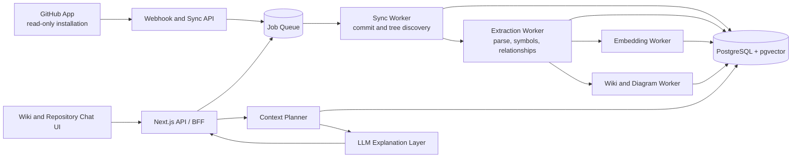
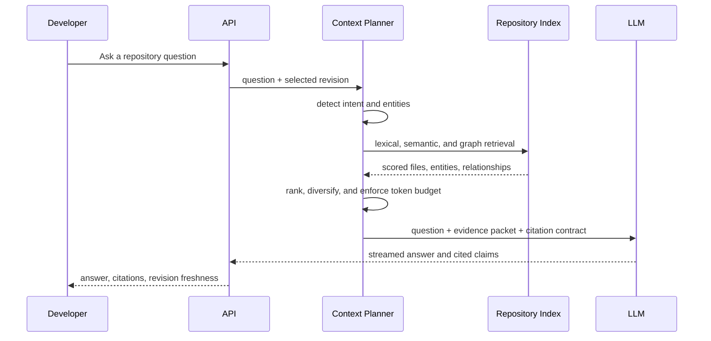

# CodeSentinel Repository Intelligence Architecture

**Status:** Proposed target architecture  
**Date:** 2026-09-03  
**Product:** Living codebase knowledge platform for onboarding and architectural discovery

## 1. Decision Summary

The pivot is valid. A repository-intelligence product can provide meaningfully better onboarding and architectural discovery than either keyword search or a generic chat interface, provided that every answer is grounded in a versioned repository index and exposes its evidence.

The product should be positioned as a **living codebase map**:

- GitHub is the source of truth.
- The platform produces a versioned, queryable model of a repository.
- The wiki is the durable, navigable knowledge product.
- Chat is an evidence-backed exploration interface, not the system of record.
- LLMs explain and summarize retrieved evidence; they do not decide what the repository contains.

This is a better and more defensible focus than an all-purpose AI code reviewer. The initial customer outcome is faster onboarding and reliable architectural orientation in unfamiliar codebases.

## 2. Validation

### Why the idea is technically feasible

The required primitives are established and fit together well:

- GitHub Apps can grant repository-scoped, read-only access.
- Tree-sitter provides fast, deterministic syntax parsing across languages.
- PostgreSQL can store repository metadata, text search indexes, graph relationships, and vectors in one operational database.
- Hybrid retrieval combines exact names and paths, semantic similarity, and structural relationships better than any one retrieval method alone.
- LLM streaming is well suited to turning a bounded evidence set into a readable explanation, summary, or Mermaid diagram.

The current codebase already validates the core direction: it has GitHub App access, file indexing, Tree-sitter parsing, symbol extraction, graph persistence, pgvector retrieval, and a repository chat route. Those components are a prototype foundation, not yet the production architecture.

### Where the product is differentiated

The differentiator is not “chat over a repository.” It is the ability to assemble an accurate architectural slice for a question:

- A developer asks where a behavior lives, how data moves, or which components are affected.
- The system resolves code entities and paths, then expands from them along meaningful relationships.
- The answer cites files, symbols, and the exact indexed commit.
- Valuable answers and generated module summaries become durable wiki pages.

### Risks to manage deliberately

| Risk | Architectural response |
| --- | --- |
| Incorrect graph edges create confident but wrong answers | Track evidence, confidence, and extraction method on every edge; only expose low-confidence inference as tentative. |
| Repositories change faster than generated documentation | Tie all derived artifacts to a commit SHA and mark stale artifacts when the default branch advances. |
| Large repositories make indexing slow or expensive | Use asynchronous jobs, incremental indexing, bounded concurrency, and content-hash reuse. |
| Sensitive source is sent unnecessarily to an LLM | Retrieve only the smallest relevant evidence set; support provider choice, redaction policies, and audit logging. |
| A chat answer becomes undocumented tribal knowledge | Allow an explicit reviewed promotion flow from answer to wiki page. |

## 3. Product Boundaries

### In scope

- Read-only GitHub repository connection and synchronization.
- Indexing supported source and documentation files.
- Symbol, import/export, route, schema, and selected behavioral relationship extraction.
- Versioned repository graph and hybrid retrieval.
- Generated module/wiki summaries, diagrams, and cited repository chat.
- Explicit human approval before any persistent generated content is published or replaced.

### Out of scope for the first product

- Editing repository code, opening pull requests, or autonomous fixes.
- Replacing static analysis or security scanners.
- Perfect whole-program call graph resolution for every language and framework.
- Treating generated documentation as authoritative when it conflicts with source.
- Cross-repository reasoning before single-repository quality is reliable.

## 4. Architecture Principles

1. **Git commit is the source of truth.** Every index, retrieval result, answer, wiki page, and diagram identifies its `commit_sha`.
2. **Deterministic extraction precedes LLM reasoning.** Parsers and resolvers produce facts. LLMs transform facts into explanations.
3. **Evidence is a first-class output.** Answers always return symbol/file citations and index freshness.
4. **Async work is explicit.** Repository sync, parsing, embedding, summarization, and diagram generation run as observable jobs, never inside a synchronous request path.
5. **Graceful degradation beats fabricated precision.** If parsing, embeddings, or relationship resolution is unavailable, provide a scoped file/text result and disclose the limitation.
6. **Least privilege and data minimization are defaults.** The GitHub App remains read-only; only retrieval-selected code is passed to a model.

## 5. Target System



### Runtime roles

| Component | Responsibility | Implementation direction |
| --- | --- | --- |
| Next.js API / BFF | Authentication, authorization, request validation, job dispatch, streamed responses | Existing App Router routes |
| GitHub integration | Installation auth, webhooks, tree/content/commit access | GitHub App plus Octokit |
| Job queue and workers | Durable background execution, retries, idempotency, concurrency limits | Dedicated worker process with a durable queue |
| Repository store | Repository metadata, revisions, files, graph, artifacts, audit records | PostgreSQL, Prisma, pgvector, full-text search |
| Extraction pipeline | Deterministic parsing and relationship resolution | Tree-sitter plus framework-aware extractors |
| Context planner | Intent classification, retrieval, ranking, context packing | Application service, model-assisted only where useful |
| LLM layer | Evidence-constrained explanation, summary, diagrams | Existing Vercel AI SDK provider boundary |
| UI | Repository status, wiki, graph evidence, chat, approval workflows | Next.js/React |

## 6. Repository Lifecycle

### Index state machine

```text
DISCONNECTED -> CONNECTED -> QUEUED -> SYNCING -> EXTRACTING -> READY
                                      |             |
                                      v             v
                                    FAILED <----- PARTIAL

READY -> STALE -> QUEUED
```

- `CONNECTED`: a user has authorized a GitHub App installation.
- `QUEUED`: a target branch and commit SHA have been selected for sync.
- `SYNCING`: the repository tree and changed blobs are being discovered.
- `EXTRACTING`: deterministic code intelligence is being computed.
- `READY`: a complete index exists for a specific commit SHA.
- `PARTIAL`: files were indexed but one or more optional enrichments failed.
- `STALE`: GitHub reports a newer default-branch commit than the latest ready index.
- `FAILED`: a retryable or terminal indexing error is recorded with diagnostics.

### Incremental sync flow

1. Receive a GitHub push or manual-sync request.
2. Resolve the target branch head and create an idempotent `IndexJob` keyed by repository plus commit SHA.
3. Compare the target tree with the last successful revision.
4. Reuse unchanged file records and derived entities by content hash.
5. Parse only added or modified supported files.
6. Re-resolve relationships affected by changed imports, exports, routes, or symbols.
7. Generate embeddings only for changed searchable entities.
8. Mark the revision `READY` only after required extraction stages succeed; optional summaries and diagrams can complete afterward.
9. Mark pages and diagrams generated from older revisions as stale rather than silently replacing them.

## 7. Data Model

The current `Repository`, `File`, `GraphNode`, and `GraphEdge` tables are a useful start. Add immutable revision ownership and operational entities before expanding feature scope.

### Core entities

| Entity | Key fields | Purpose |
| --- | --- | --- |
| `Repository` | provider ID, owner, name, default branch, installation ID | Stable identity and access boundary |
| `RepositoryRevision` | repository ID, commit SHA, parent SHA, status, indexed at | Immutable index snapshot |
| `RepositoryFile` | revision ID, path, blob SHA, language, size, content status | File inventory for one revision |
| `CodeEntity` | revision ID, file ID, kind, qualified name, span, signature, exported | Symbols and structural entities |
| `CodeRelationship` | revision ID, source entity, target entity, kind, evidence, confidence | Resolved graph edges |
| `SearchDocument` | revision ID, entity/file reference, text, embedding, metadata | Full-text and vector retrieval unit |
| `IndexJob` | repository ID, revision ID, stage, attempt, error, timestamps | Durable and observable background work |
| `WikiPage` | repository ID, revision ID, scope, content, status, source citations | Generated or curated durable documentation |
| `Diagram` | wiki page/revision ID, type, Mermaid source, citations, status | Versioned visual artifact |
| `ChatAnswer` | revision ID, question, answer, citations, model metadata | Auditability and promotion source |

### Entity and edge design

Use a single `CodeEntity` model for repository, folder, file, symbol, route, schema/model, and component nodes. Store `kind` as a controlled enum and attach extensible metadata as JSON.

Relationships must preserve how they were found:

```text
CodeRelationship
  source_entity_id
  target_entity_id
  kind: IMPORTS | EXPORTS | CALLS | INHERITS | DEFINES_ROUTE |
        READS_STORE | WRITES_STORE | QUERIES_MODEL | FETCHES_ROUTE | CONTAINS
  evidence: { file_path, start_line, end_line, extractor, raw_reference }
  confidence: 0.0..1.0
  resolution: EXACT | HEURISTIC | UNRESOLVED
```

Do not create final graph edges from a globally shared symbol name. Imports must be resolved against module paths, exports, aliases, package configuration, and language semantics. Preserve unresolved references for later resolvers instead of presenting them as facts.

## 8. Code Intelligence Pipeline

```text
Repository revision
  -> File classifier and content guard
  -> Parser selection
  -> AST parse
  -> Symbol and export extraction
  -> Framework-specific extraction
  -> Reference collection
  -> Resolver
  -> Graph persistence
  -> Search-document generation and embeddings
```

### Extraction tiers

Build reliable, deterministic layers in this order:

1. **Tier 1: structural facts** - paths, folders, files, language, imports, exports, functions, classes, interfaces, types, and containment.
2. **Tier 2: framework facts** - HTTP routes, ORM schemas/models, React components, service/module conventions, and configuration entry points.
3. **Tier 3: behavioral inference** - fetch-to-route mapping, store reads/writes, model access, call relationships, and event/message flows.

Tier 3 should be opt-in by language/framework capability and always carry evidence plus confidence. It is the most valuable layer for data-flow answers and the most likely to be wrong if generalized prematurely.

### Supported-language policy

Start with TypeScript and JavaScript, where the application already has parsing support and the team can validate framework-specific behavior. Add Python only after a tested resolver exists. Other languages should still be catalogued as files and searchable documents, but not advertised as graph-complete.

## 9. Context Planner

The context planner is the core product service. It creates a bounded, explainable evidence packet before any LLM call.

### Query flow



### Retrieval strategy

1. **Resolve direct references first.** Exact file paths, symbols, route names, and identifiers outrank broad search.
2. **Run lexical retrieval.** PostgreSQL full-text and path/name matching catch exact engineering vocabulary.
3. **Run semantic retrieval.** Vector search finds conceptually related modules and documentation.
4. **Expand the graph by intent.** A locational query takes shallow neighbors; data-flow questions take typed, bounded traversals; schema questions favor models and relationship definitions.
5. **Rank and diversify.** Prefer direct evidence, high-confidence relationships, entry points, and a mix of files rather than many near-duplicate snippets.
6. **Pack to a budget.** Include entity metadata and narrow source spans before full files. Maintain citations while trimming.

### Intent policy

| Intent | Retrieval emphasis | Default artifact |
| --- | --- | --- |
| Locational | exact symbols, paths, shallow graph | file/symbol pointers |
| Exploratory | module entry points, folder summaries, imports | flowchart when useful |
| Data flow | routes, calls, fetches, stores, models | sequence diagram when evidence is sufficient |
| Schema | ORM/schema entities and database access | ER diagram when evidence is sufficient |
| Change impact | dependents, callers, imports, tests | impact list, no diagram by default |

The LLM-based intent detector is optional optimization, not a gate. A deterministic fallback must classify simple path and identifier queries without a model call.

## 10. Wiki, Diagrams, and Chat

### Wiki generation

The system generates a page for a repository, major folder, and selected domain/module. Each page contains:

- Scope and revision metadata.
- Summary of responsibilities.
- Key entry points and dependencies.
- Cited files and code entities.
- Freshness status.
- Optional diagrams with the same evidence set.
- A review status: `GENERATED`, `HUMAN_REVIEWED`, `STALE`, or `ARCHIVED`.

Summarization is a resumable background job. It must not block indexing readiness or chat availability.

### Diagram generation

Generate Mermaid only from a typed graph slice, not from an unconstrained prose prompt. Validate generated Mermaid syntax and retain the graph-node and edge citations used to create it. If the graph contains unresolved or low-confidence relationships, show a flowchart of verified structure or omit the diagram.

### Chat contract

Every answer returns:

- The repository revision and freshness state.
- Source file and code entity citations with line spans when available.
- A statement of uncertainty when evidence is incomplete.
- No claim that is unsupported by the retrieved evidence packet.

Promotion from chat to a wiki page is explicit. A user selects the content, scope, title, and cited sources; the system then creates a draft page for review.

## 11. Security and Privacy

- Use a GitHub App with only `Contents: read` and `Metadata: read` permissions.
- Verify GitHub webhook signatures before enqueuing work.
- Authorize every repository request against its installation and user/account ownership; do not accept a repository ID as sufficient access proof.
- Encrypt installation credentials and never expose them to the browser.
- Apply repository-configurable path exclusions before fetching or embedding content, including secrets, generated artifacts, and vendor directories.
- Limit source sent to the LLM to the final context packet; log metadata and hashes rather than full prompts by default.
- Separate tenant data in every database query with repository and account ownership checks.
- Maintain audit records for indexing, model calls, generated artifacts, and approvals.

## 12. Reliability and Operations

### Required operational controls

- Idempotency key: `repository_id + commit_sha + pipeline_version`.
- Per-repository concurrency limit to avoid GitHub rate-limit spikes.
- Retries with backoff for network/model failures and dead-letter visibility for terminal failures.
- Stage-level telemetry: files discovered, parsed, skipped, failed, entities extracted, relationships resolved, embeddings generated, and duration.
- Cost telemetry: embedding and generation counts/estimates per repository revision.
- Readiness metrics: index freshness, parse success rate, graph-resolution rate, citation coverage, and answer abstention rate.

### Service boundaries

The first implementation can remain a single deployable application plus worker process and PostgreSQL. Keep boundaries in code so that the worker, model provider, and graph/retrieval services can scale independently later. Do not introduce microservices until queue pressure or team ownership justifies them.

## 13. Implementation Sequence

### Phase 0: Make the current prototype honest

- Add repository revision and job records.
- Stop deleting the complete file/graph state before a new index is ready.
- Surface index status, commit SHA, and partial failures in the UI/API.
- Correct current graph behavior so unresolved imports/calls are not implied as resolved edges.

### Phase 1: Reliable repository index

- Implement GitHub webhook-driven and manual sync jobs.
- Add incremental file synchronization by blob SHA.
- Support TypeScript/JavaScript structural extraction with tested module resolution.
- Persist files, entities, relationships, and searchable chunks against revisions.

### Phase 2: Evidence-backed repository chat

- Consolidate intent detection in one service.
- Implement retrieval ranking, typed graph traversal, token packing, and citation payloads.
- Add revision/freshness disclosure and explicit abstention behavior.
- Evaluate with a small benchmark set of repository questions and expected citations.

### Phase 3: Living wiki

- Generate folder/module summaries as background jobs.
- Create the revisioned wiki UI with stale indicators and source links.
- Add explicit promotion from chat to a wiki draft.

### Phase 4: Higher-value behavioral intelligence

- Add framework adapters for routes, ORM models, fetches, stores, and selected call chains.
- Build diagrams from verified graph slices.
- Add change-impact queries and refresh summaries selectively after a commit.

## 14. Definition of a Useful First Release

A repository is considered product-ready when a developer can:

1. Install the read-only GitHub App and select a repository.
2. See a completed index tied to a visible commit SHA.
3. Browse a generated repository and module overview with source citations.
4. Ask “Where is X?”, “How does Y work?”, and “What is affected by Z?” and receive an answer grounded in the indexed revision.
5. Open every cited file/symbol from an answer.
6. See when the answer or page is stale after a newer commit exists.
7. Promote a useful cited answer into a reviewable wiki draft.

## 15. Decisions to Keep Open Until Implementation Planning

- Queue technology: choose based on the deployment platform and operational constraints, but require durability and retries.
- Embedding model/provider: select after measuring retrieval quality, cost, and data-handling needs against real repositories.
- Full source retention: make it a customer-configurable policy; it is not required for every retrieval approach.
- Multi-repository or organization-wide graph: defer until single-repository revision correctness is proven.
- Write-back to GitHub: defer entirely; reviewed wiki content should initially live in the platform.

## 16. Current-Codebase Alignment

The following existing areas map directly to this architecture:

| Existing area | Keep | Change before relying on it |
| --- | --- | --- |
| `src/features/github/indexer/github-client.ts` | GitHub App client and initial tree/content flow | Move indexing to durable jobs, make it incremental, and version it by commit SHA. |
| `src/features/code-intelligence/` | Tree-sitter parser and symbol/edge extraction | Add module-aware resolution, evidence, confidence, and tested framework adapters. |
| `src/features/context-engine/` | Intent, hybrid retrieval, budget concepts | Add ranking, intent-specific traversal, revision filters, and deterministic fallback. |
| `src/features/llm-reasoning/` | Provider and streaming integration | Require evidence packets/citations and keep model logic separate from retrieval. |
| `prisma/schema.prisma` | Repository/file/graph foundation | Add revisions, jobs, search documents, wiki artifacts, and revision ownership. |
| Repository chat route | Streaming interaction pattern | Replace inline intent logic and weak citations with the context planner contract. |

## 17. Architecture Decision

Proceed with the repository-intelligence direction, with a **versioned repository index and evidence-backed context planner** as the first architectural investment. Do not begin by expanding chat features or diagram polish. Reliable indexing, graph resolution, freshness, and citations are the product foundation; the wiki and chat become valuable once that foundation is dependable.
